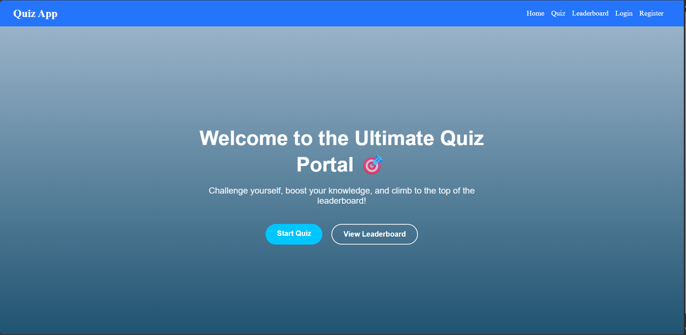
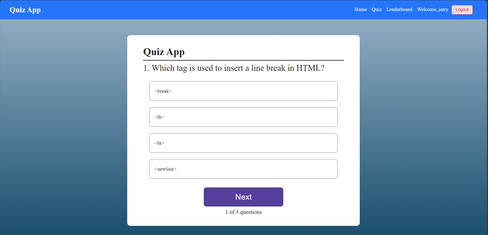
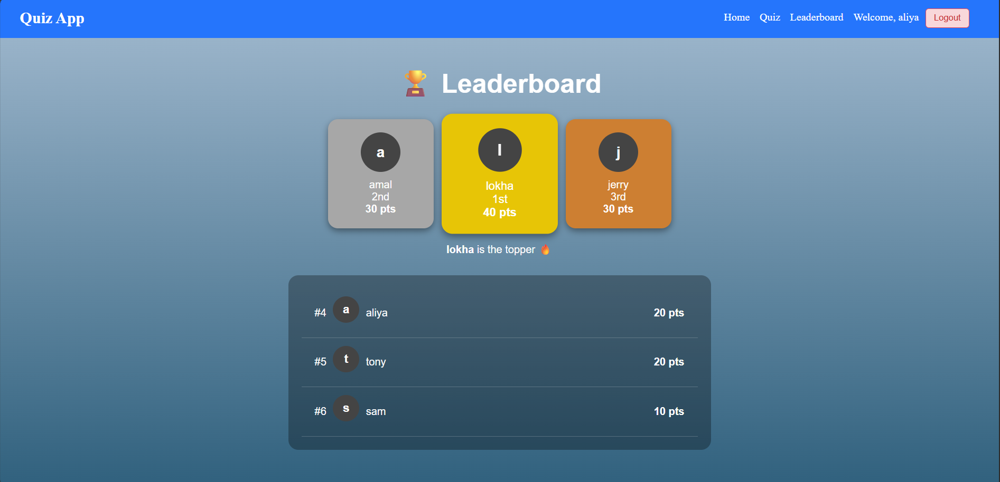

# 🧠 Quiz App

A full-stack **Quiz Application** built with **React (frontend)** and **Flask (backend)**.  
Users can register, log in, take randomized quizzes, and submit their scores — which are then displayed on a leaderboard.

---

## 🚀 Features

✅ User Authentication (Register & Login)  
✅ Randomized Quiz Questions  
✅ Score Submission to Flask Backend  
✅ Leaderboard with Top Scores  
✅ Responsive, Clean UI  
✅ Toast Popup for Score Submission Success  

---

## 🛠️ Tech Stack

### Frontend
- React (Vite)
- Axios (API requests)
- CSS (custom styling)
- React Router (navigation)

### Backend
- Flask (Python)
- Flask-SQLAlchemy (ORM)
- SQLite (database)
- bcrypt / Werkzeug (password hashing)

---

## ⚙️ Setup Instructions

### 🧩 Backend Setup

1. Navigate to backend folder  
   `cd backend`

2. Create a virtual environment  
   `python -m venv venv`

3. Activate the environment  
   - Windows: `venv\Scripts\activate`  
   - macOS/Linux: `source venv/bin/activate`

4. Install dependencies  
   `pip install -r requirements.txt`

5. Run the Flask app  
   `python run.py`

   Flask will start on → `http://127.0.0.1:5000`

---

### 💻 Frontend Setup

1. Navigate to frontend folder  
   `cd frontend`

2. Install dependencies  
   `npm install`

3. Start development server  
   `npm run dev`

   React app will start on → `http://localhost:5173`

---

## 🧮 Usage

- Visit the frontend URL (`http://localhost:5173`)
- Register a new account (username + email + password)
- Take a quiz of 10 random questions
- On completion:
  - Your score is submitted automatically
  - A success popup appears
  - You can view scores on the Leaderboard page

---

## 🗂️ Database Info

- Database: SQLite  
- Tables:
  - `user`
  - `quiz_score`
- Stored in `backend/app/instance/quiz.db`
- Not included in repo (auto-created when backend runs)

---

## 📸 Screenshots (Optional)

Add screenshots to `frontend/src/assets/` and reference them like:

  

---

## Author

**Akshay Kumar M V**  
